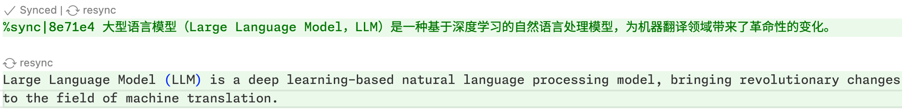
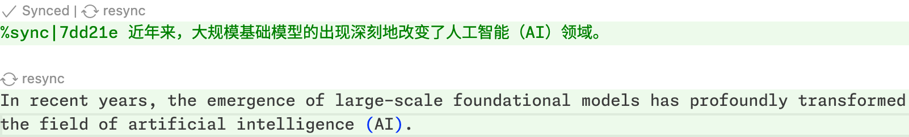
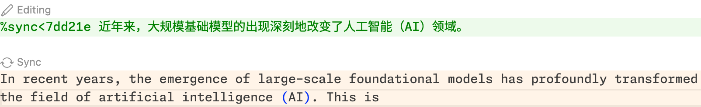
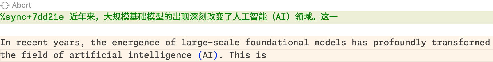

# Sync-Writer

   



专为非英语母语者设计的 $\LaTeX$ 写作工具，**只需编写非英语的文本注释，即可同步生成符合英语学术写作规范的 $\LaTeX$ 文本**。

- 使用LLM，将非英文注释翻译为符合英语学术写作规范的 $\LaTeX$ 文本；
- 注释和正文之间保持同步，无论编辑哪一方，另一方都会自动更新；
- 增量翻译，内容更新时翻译文本将参考上一次的翻译结果，保证用词、风格的一致性；
- 支持术语定义，确保同一篇文档中术语的一致性；
- 支持自动记录写作偏好，确保同一篇文档中的写作风格的一致性。

# ⚠️ 注意

本插件使用**符合 OpenAI API 接口形式的 LLM API 进行翻译**，因此需要你自行准备 API 密钥并配置相对应的 base URL。当没有正确设置 API 密钥时，插件将无法正常工作。

你可以在 VSCode 设置中搜索 `sync-writer: Base-url`来设置 base URL。出于安全原因，你无法在设置页面设置 API key，但你可以随时在命令面板中使用 `Sync Writer: Set OpenAI API Key` 命令来设置 API 密钥。

除了使用 OpenAI API 外，你也可以在如下平台上申请 API 密钥并设置相应的 base URL：

- Deepseek：https://platform.deepseek.com/ ，base URL 为 `https://api.deepseek.com/`
- GLM：https://open.bigmodel.cn/ ，base URL 为 `https://open.bigmodel.cn/api/paas/v4`
- (其他符合OpenAI API接口形式的API)

# 同步块

## 基本概念

同步块分为两个部分，即**源语言部分**和**目标语言部分**。源语言部分是以使用者母语书写的文本，需要写在以`%sync` 开头的注释中；目标语言部分是根据源语言部分自动生成的符合英语学术写作规范的 $\LaTeX$ 文本。两行文本之间由一个空行分隔。

```diff
%sync|1a2b3c 钵钵鸡是一种四川眉山一带的特色美食，以其麻辣鲜香而著称。

+ Bowl chicken is a special delicacy in Meishan, Sichuan, known for its spicy and fragrant taste.
```

当编辑注释时：

```diff
- %sync|1a2b3c 钵钵鸡是一种四川眉山一带的特色美食，以其麻辣鲜香而著称。
+ %sync>1a2b3c 钵钵鸡是一种四川眉山一带的特色美食，1990年代起在四川省内外广受欢迎。

Bowl chicken is a special delicacy in Meishan, Sichuan, known for its spicy and fragrant taste.
```

正文会相应的更新：

```diff
%sync|1a2b3c 钵钵鸡是一种四川眉山一带的特色美食，1990年代起在四川省内外广受欢迎。

+ Bowl chicken is a special delicacy in Meishan, Sichuan, which has been popular in and out of Sichuan Province since the 1990s.
```

当你觉得翻译结果有需要改进的地方时，可**直接对正文进行编辑**：

```diff
%sync<1a2b3c 钵钵鸡是一种四川眉山一带的特色美食，1990年代起在四川省内外广受欢迎。

- Bowl chicken is a special delicacy in Meishan, Sichuan, which has been popular in and out of Sichuan Province since the 1990s.
+ Bowl chicken is a special delicacy in Meishan, Sichuan. It has been popular in and out of Sichuan Province since the 1990s.
```

随后，注释也会自动更新：

```diff
- %sync|1a2b3c 钵钵鸡是一种四川眉山一带的特色美食，1990年代起在四川省内外广受欢迎。
+ %sync|1a2b3c 钵钵鸡是一种四川眉山一带的特色美食。自1990年代以来，它在四川省内外广受欢迎。

Bowl chicken is a special delicacy in Meishan, Sichuan. It has been popular in and out of Sichuan Province since the 1990s.
```

**⚠️ 注意**：**请不要修改同步块的前缀**（如上例中的 `%sync|1a2b3c `），否则同步将会失效。

## 创建同步块

- 从源语言部分创建同步块：添加 `%sync` 开头的注释（当输入 `sync` 后，将会有 snippet 提示）即创建了同步块中的源语言部分，与其相对应的目标语言部分默认为换行后的下一行文本。
- 从目标语言部分创建同步块：将光标置于已有文本中，使用 `Ctrl+Shift+P` 打开命令面板，搜索 `Sync Writer: Create a sync block from current selection`，即可创建对应的源语言部分。

## 特点

- 非规范内容的翻译：源语言部分中可以包含非规范的 LaTeX 语法（比如 `a_temp`等）或 Markdown 语法（比如`**粗体**`），插件会自动将其翻译为符合规范的 LaTeX 语法（比如 `a_{\text{temp}}`和 `\textbf{粗体}`）。

# 触发同步

在编辑了源语言或目标语言部分后，同步块将处于“编辑中”（前缀变为`%sync>1a2b3c`或`%sync<1a2b3c`）的状态。此时，你可以通过以下方式触发同步：

## 手动同步

- 快捷键：如果你想要立即手动触发同步，可以使用 `Ctrl+Shift+S` 快捷键。
- 保存时同步：按 `Ctrl+S` 保存文件时，如果当前光标处于某一个同步块中，该同步块将会自动触发同步。

## 自动同步

在设置中提供了名为 `sync-writer.sync.autoSync` 的选项（默认关闭），当该选项开启时，默认在**每次输入完整的句子后（以句号、问号或分号作为结尾）会触发一次同步**。

比如，当你输入了：

```diff
%sync>1a2b3c 钵钵鸡是一种四川眉山一带的特色美食，1990年代起在四川省内外广受欢
```

正文不会自动更新，只有当你输入了完整的句子后：

```diff
- %sync>1a2b3c 钵钵鸡是一种四川眉山一带的特色美食，1990年代起在四川省内外广受欢
+ %sync>1a2b3c 钵钵鸡是一种四川眉山一带的特色美食，1990年代起在四川省内外广受欢迎。

+ Bowl chicken is a special delicacy in Meishan, Sichuan, known for its spicy and fragrant taste.
```

正文才会自动更新。

请注意，当开启该选项时将会更为频繁的触发同步，可能会增加对应的 LLM API 调用次数。

# 增量同步

当对同步块中的内容进行编辑后，**下一次同步将参考上一次的翻译结果**，保证用词、风格的一致性。

比如，当你编辑了同步块中的源语言部分：

```diff
- %sync|1a2b3c 钵钵鸡是一种四川眉山一带的特色美食，1990年代起在四川省内外广受欢迎。
+ %sync|1a2b3c 钵钵鸡是一种四川眉山一带的特色美食。自1990年代以来，它在四川省内外广受欢迎。

Bowl chicken is a special delicacy in Meishan, Sichuan, known for its spicy and fragrant taste.
```

在翻译时，LLM 实际看到的是：

```markdown
# Previous Translation

Source: 钵钵鸡是一种四川眉山一带的特色美食，1990 年代起在四川省内外广受欢迎。

Translation: Bowl chicken is a special delicacy in Meishan, Sichuan, known for its spicy and fragrant taste.

# Current Translation

Source: 钵钵鸡是一种四川眉山一带的特色美食。自 1990 年代以来，它在四川省内外广受欢迎。

Translation:
```

因此，**大部分没有改变的内容都会保持与上一次同步时的翻译结果完全一致**，只会重新翻译新增/修改的部分。

# 同步块状态 & 操作

同步块可能处于已同步、同步中和编辑中三种状态。在每一个同步块上都会展示若干**同步块操作**，根据同步块所处的状态不同，会有不同的操作：



- 已同步（`Synced`）：
  - 源语言部分的 `resync`：重新翻译源语言部分；
  - 目标语言部分的 `resync`：重新翻译源语言部分；

在重新进行翻译时，可以输入一些**指令**，比如修改翻译的风格、调整翻译的准确性等；LLM 将会遵照给定的指令将内容重新进行翻译。



- 编辑中（`Editing`）：
  - 同步（`Sync`）：手动触发同步；



- 同步中（`Syncing`）：
  - 取消同步（`Abort`）：取消同步操作并回滚到上一次的同步结果；

# 配置文件

配置文件默认放在当前**打开工作区根目录下的 `sync-writer.json` 文件中**。一个典型的配置文件如下：

```json
{
  "references": {
    "glossary": [
      { "source": "钵钵鸡", "target": "Bowl chicken" },
      { "source": "麻辣鲜香", "target": "spicy and fragrant" }
    ],
    "preferences": [
      { "source": "我们强调了", "target": "we emphasized" },
      { "source": "我们提出了", "target": "we proposed" }
    ]
  }
}
```

## 术语定义

术语定义对应配置文件中的 `references > glossary`，你可以预先定义一些术语，确保同一篇文档中术语的一致性，如：

```json
{
  "references": {
    "glossary": [
      { "source": "钵钵鸡", "target": "Bowl chicken" },
      { "source": "麻辣鲜香", "target": "spicy and fragrant" }
    ]
  }
}
```

进行如上配置后，当你输入了 `钵钵鸡` 时，将总会翻译为 `Bowl chicken` 而非其他同义说法。

在翻译过程中，如果遇到了已经定义的术语，LLM 将会尽量采用你所规定的翻译。

## 写作偏好记录 （TODO）

写作偏好记录对应配置文件中的 `references > preferences`，与 ChatGPT 网页版的 Memory 功能类似，**Sync-Writer 会自动记录你的写作偏好**，确保同一篇文档中的风格的一致性。

比如，当你多次使用 `Bobo-Chicken`，而不是 `Bowl chicken` 时，Sync-Writer 会自动记录你的偏好：

```diff
{
  "references": {
    "preferences": [
      { "source": "我们强调了", "target": "we emphasized" },
      { "source": "我们提出了", "target": "we proposed" },
+     { "source": "钵钵鸡", "target": "Bobo-Chicken" }
    ]
  }
}
```

随后，当你再次输入钵钵鸡时，将会自动翻译为 Bobo-Chicken 而不是 Bowl chicken：

```diff
%sync|1a2b3c 钵钵鸡是一种四川眉山一带的特色美食，1990年代起在四川省内外广受欢迎。

- Bowl chicken is a special delicacy in Meishan, Sichuan. It has been popular in and out of Sichuan Province since the 1990s.
+ Bobo-Chicken is a special delicacy in Meishan, Sichuan. It has been popular in and out of Sichuan Province since the 1990s.
```

与术语定义类似，所有自动记录的写作偏好都可以在 `sync-writer.json` 中找到，你也可以手动编辑这个文件。

# Roadmap

- [x] bugfix: 配置文件不起作用
- [ ] 功能：添加多行sync块支持；
- [ ] 体验优化：通过 `vscode.walkThrough` 添加更方便的API配置界面；
- [ ] 体验优化：生成时将原文本内容变成浅色背景文本；在生成相同前缀时原文本内容不消失；生成第一个不同文本时才消失；